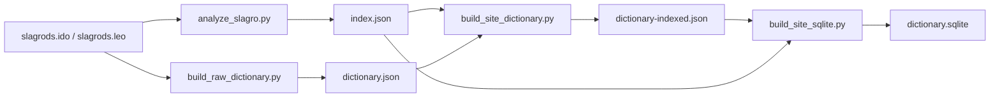
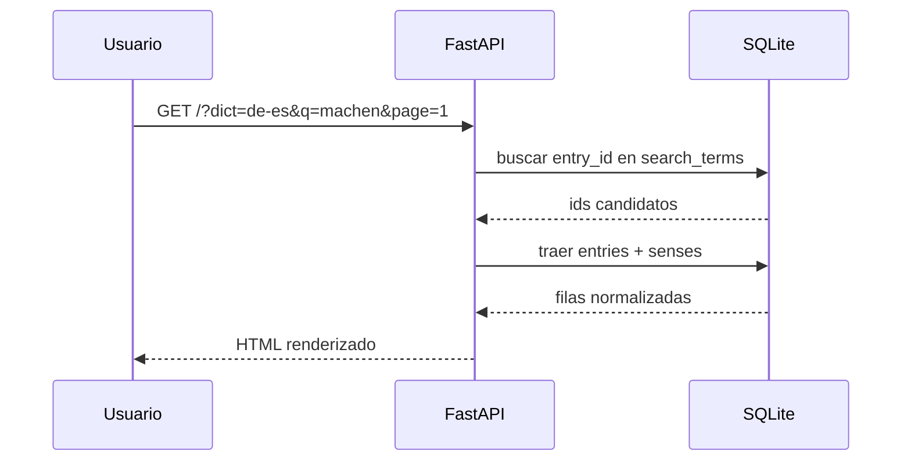
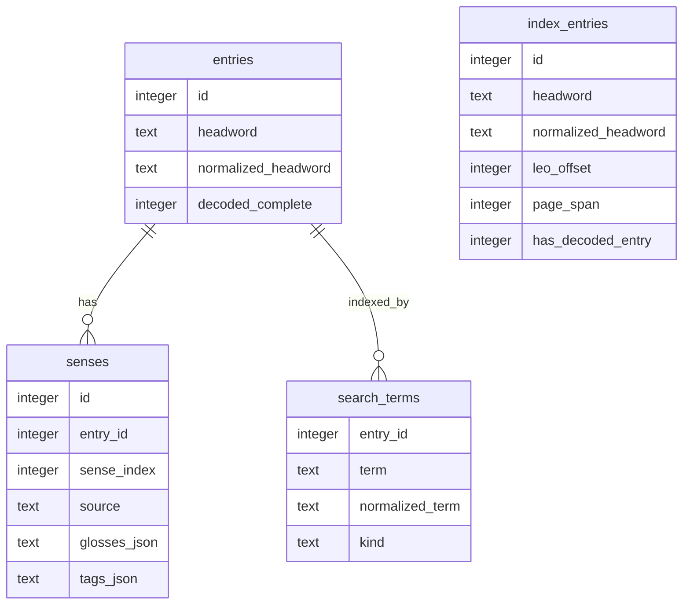

# Dictionary

Buscador web para un diccionario alemán-español y español-alemán reconstruido a
partir de archivos de datos de una aplicación Windows antigua.

La app publicada hoy corre con FastAPI y usa SQLite como base de consulta. La
generación de datos sigue en Python y se apoya en una pequeña pipeline de
ingeniería inversa para pasar de `IDO/LEO` a un formato web consultable.

## Qué hace el sitio

- permite buscar por palabra fuente en las dos direcciones
- pagina resultados en el servidor
- resalta abreviaturas gramaticales, marcas semánticas y etiquetas
- trabaja directamente sobre dos bases SQLite incluidas en el proyecto

## Estructura

```text
dictionary/
  app.py                 FastAPI app y wiring de templates/estáticos
  search.py              lógica de búsqueda, normalización y render de glosas
  templates/index.html   interfaz HTML server-side
  static/styles.css      estilos

site/data/
  dictionary.sqlite      alemán -> español
  es-de-dictionary.sqlite español -> alemán
  *.json                 artefactos intermedios y de build

tools/
  analyze_slagro.py      exporta índices auténticos desde IDO/LEO
  build_raw_dictionary.py genera diccionario crudo desde IDO/LEO + DLL
  build_site_dictionary.py limpia y agrupa entradas
  build_site_sqlite.py   genera SQLite para la web
```

## Cómo funciona

### 1. Build de datos

La web no lee `IDO` ni `LEO` directamente. Antes se genera una base SQLite por
dirección:



Para `es -> de` se usa la misma pipeline sobre `slagrosd.IDO/LEO`.

### 2. Consulta web

La app FastAPI abre la SQLite correspondiente según el query param `dict`:

- `de-es`
- `es-de`

Después:

1. normaliza la búsqueda
2. consulta `search_terms`
3. rankea coincidencia exacta, luego prefijo y luego contenido
4. trae las acepciones desde `senses`
5. renderiza HTML con Jinja2



## Detalle técnico FastAPI

La aplicación expone:

- entrypoint: `dictionary.app:app`
- ruta principal: `GET /`
- healthcheck: `GET /healthz`

El render es server-side, sin SPA ni frontend compilado. La UI sale desde
[`dictionary/templates/index.html`](/home/tin/lab/UniLex/dictionary/templates/index.html)
y usa helpers registrados en Jinja2 desde
[`dictionary/app.py`](/home/tin/lab/UniLex/dictionary/app.py).

La lógica de búsqueda está concentrada en
[`dictionary/search.py`](/home/tin/lab/UniLex/dictionary/search.py):

- `normalize_for_search()`: saca acentos y normaliza texto
- `search_entries()`: hace ranking y paginación
- `find_unresolved_index_entry()`: muestra fallback si el índice conoce un lema
  pero todavía no hay artículo reconstruido
- `render_gloss_html()`: colorea etiquetas, notas y abreviaturas

## Detalle técnico SQLite

Cada base tiene estas tablas principales:

- `entries`: una fila por lema agrupado
- `senses`: acepciones de cada lema
- `search_terms`: términos indexados para búsqueda
- `index_entries`: índice auténtico derivado del `IDO`, incluso si todavía no
  existe artículo decodificado
- `metadata`: contadores y origen del build



## Comandos útiles

Regenerar todo:

```bash
make build-data
```

Solo alemán -> español:

```bash
make build-data-de-es
```

Solo español -> alemán:

```bash
make build-data-es-de
```

Correr local:

```bash
make lock-fastapi
make serve
```

## Deploy

FastAPI Cloud detecta la app desde `pyproject.toml`:

```toml
[tool.fastapi]
entrypoint = "dictionary.app:app"
```

El proyecto incluye `uv.lock`, por lo que las dependencias quedan pinneadas
también en deploy.

## Documentación adicional

- [Ingeniería inversa del formato](./docs/ingenieria-inversa.md)
