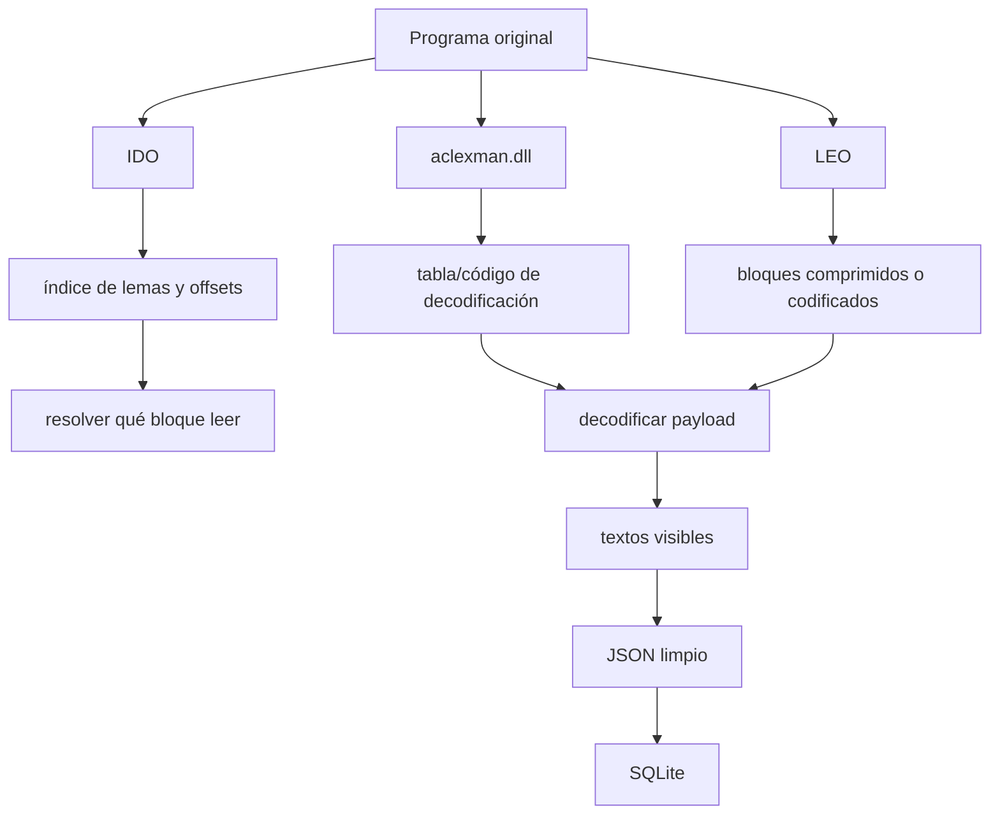
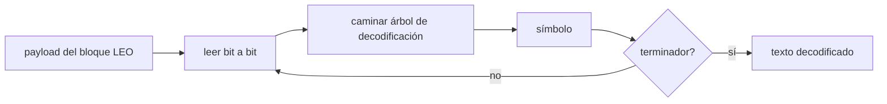
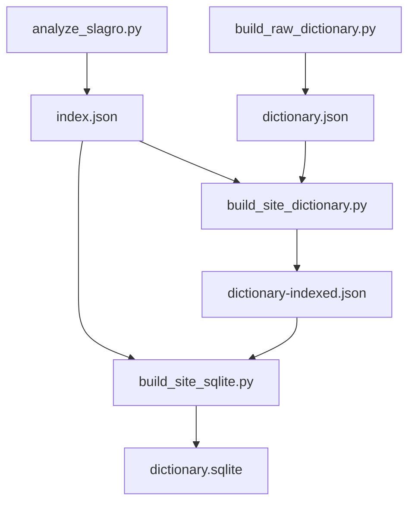

# Ingeniería inversa del diccionario

Este documento explica, en lenguaje más humano, qué se hizo para pasar de un
programa viejo de Windows a un buscador web con datos propios.

La idea no fue romper la activación ni modificar el ejecutable para desbloquear
el software. El trabajo consistió en entender cómo estaban guardados los datos
del diccionario y extraerlos directamente desde sus archivos.

## Qué encontramos

El paquete original contiene, entre otras cosas:

- archivos `IDO`
- archivos `LEO`
- una DLL llamada `aclexman.dll`

Había dos juegos de datos:

- `slagrods.ido` + `slagrods.leo`: alemán -> español
- `slagrosd.IDO` + `slagrosd.LEO`: español -> alemán

## Idea general

El problema se resolvió en capas:

1. identificar los índices de palabras
2. entender cómo esos índices apuntan a bloques dentro del archivo `LEO`
3. reconstruir el decoder del texto
4. limpiar y reagrupar el resultado para web

## Qué aporta cada archivo

### IDO

El `IDO` funciona como índice. Ahí aparecen:

- palabras o formas de búsqueda
- offsets hacia el `LEO`
- un `page_span` o tamaño lógico del bloque
- tipo de registro

En otras palabras: el `IDO` no trae toda la definición, pero sí dice dónde ir a
buscarla.

### LEO

El `LEO` contiene los artículos reales del diccionario, pero no en texto plano.
Está organizado en páginas o bloques con payload codificado.

### DLL

La DLL fue clave porque ahí vive la lógica que el programa usa para convertir
esos bytes del `LEO` en texto legible.

No se necesitó ejecutar el programa completo: alcanzó con reconstruir la tabla
de decodificación y replicar el algoritmo en Python.

## Cómo se hizo en la práctica

### 1. Inspección del índice

Con [`tools/analyze_slagro.py`](/home/tin/lab/UniLex/tools/analyze_slagro.py) y
[`tools/inspect_unilex.py`](/home/tin/lab/UniLex/tools/inspect_unilex.py) se
validó que:

- el `IDO` contenía registros auténticos
- los offsets realmente apuntaban a páginas válidas del `LEO`
- había más de un tipo de registro, especialmente importante para `es -> de`

Uno de los descubrimientos importantes fue que para `es -> de` no alcanzaba con
filtrar solo el tipo `0x8e`. Había entradas válidas en otros tipos, por eso se
agregó el modo `--record-type none`.

### 2. Reconstrucción del decoder

Se inspeccionó `aclexman.dll` para recuperar la tabla que usa el decoder. Esa
tabla quedó modelada en Python como un árbol binario de símbolos.

Después, con esa tabla:

1. se lee el payload del bloque `LEO`
2. se recorre bit a bit
3. se emiten símbolos hasta encontrar el terminador

Eso hoy vive en
[`tools/build_raw_dictionary.py`](/home/tin/lab/UniLex/tools/build_raw_dictionary.py).

### 3. Separar texto visible de metadatos

Una vez decodificado el bloque:

- se toma la parte visible antes de ciertos separadores internos
- se limpian marcas de formato
- se normalizan saltos de línea

Ahí aparece un primer resultado usable: líneas de texto cercanas a lo que veía
la aplicación original.

### 4. Derivar el lema correcto

No siempre el lema del índice era la mejor clave web. En muchos casos hubo que
derivarlo del propio texto visible del artículo.

Esto fue especialmente importante para el diccionario español -> alemán, donde
algunos registros del índice venían truncados o poco útiles para el uso web.

### 5. Agrupar y limpiar

Después se hizo una etapa de limpieza:

- agrupar entradas que comparten el mismo lema final
- conservar variantes razonables
- deduplicar acepciones
- ordenar resultados de manera estable

El resultado intermedio es `dictionary-indexed.json`.

### 6. Llevarlo a SQLite

Por último, ese JSON limpio se transforma en SQLite para que la web pueda:

- buscar rápido
- paginar
- consultar sin cargar todo en memoria del navegador

## Qué scripts participan

## Qué quedó bien resuelto

- ambas direcciones del diccionario están online
- el sitio busca por palabra fuente y pagina en servidor
- muchas entradas complejas, como `machen` o `hacer`, ya salen completas
- la base resultante es portable y apta para deploy simple

## Qué límites siguen existiendo

Todavía hay algunos casos donde:

- un lema existe en el índice pero no quedó reconstruido del todo
- ciertas glosas arrastran marcas internas raras del original
- el texto visible no siempre queda tan elegante como una edición manual

Por eso la web conserva un fallback basado en `index_entries`: si el índice
conoce una palabra pero no hay artículo terminado, la app puede al menos avisar
que existe.

## Resumen corto

No se “decompiló el programa completo” en el sentido tradicional. Se hizo algo
más útil para este objetivo:

- entender la estructura del índice
- reconstruir el decoder de artículos
- convertir el material a un formato abierto y consultable

Eso permitió separar los datos del software viejo y llevarlos a una app web
simple, portable y mantenible.
